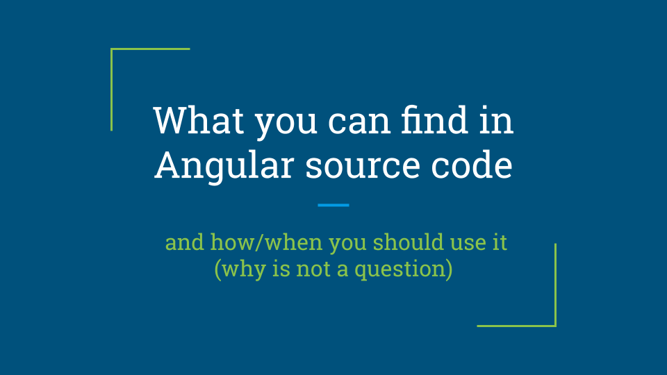

# What the Angular

## Repository for session "What you can find in Angular source code  and how/when you should use it"
Full slides can be found here [here](https://docs.google.com/presentation/d/1NIq7qKToHwltc10dxWXEjd0qHBLix48xzIwTtanBlqo/edit?usp=sharing).

Let me know if something is wrong. Create an Issue to this repo :)

## Build
Repository contains two "angular-cli like" apps.

`antagonist/` - application for first part of session (Console as a Service, Initializers).
 
`events/` - application for second part of session (EventEmitter). 

### Application development
Just execute `yarn start` command to run.

### Application testing
Just execute `yarn test` for unit testing.

## Tags
Repository contains few git tags. Use it to navigate between changes;

`console` - app without console as a service. Start here to code your own ConsoleService.

`console-tests` - app without ConsoleService unit tests. Start here to create some tests.

`app-init` - app ready for Initializers part of session.

`app-init-tests` - app with `APP_INITIALIZER`. Start here to create some tests for it.

`platform-init` - app with `APP_INITIALIZER` tests and `PLATFROM_INITIALIZER` demo.

`app-bootstrap` - app with `APP_BOOTSTRAP_LISTENER` demo.

`summary` - app with `console.log` of Initializers execution order.

`emitters` - app with event emitters demo.

## Contact
Please contact me via this repo. Just create issue or pull request.

## License
Feel free to use my code from this repository.